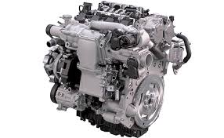
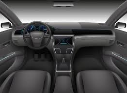
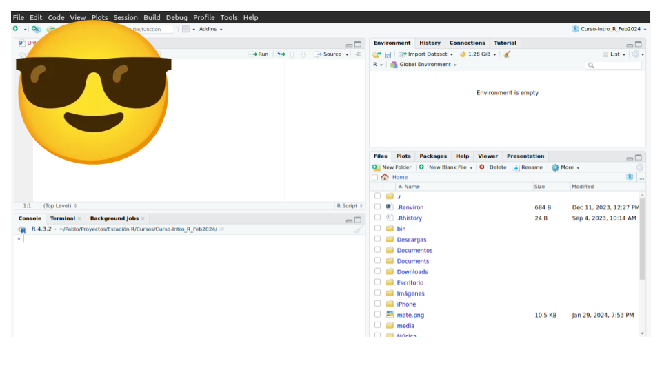
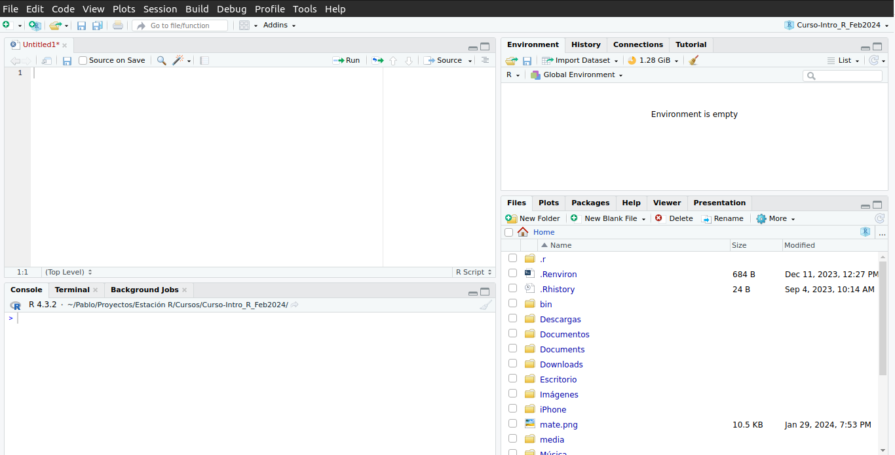

```{r, include = F}
# This is the recommended set up for flipbooks
# you might think about setting cache to TRUE as you gain practice --- building flipbooks from scratch can be time consuming
#knitr::opts_chunk$set(fig.width = 10, message = FALSE, warning = FALSE)

options(htmltools.dir.version = FALSE,
        tibble.width = NULL)

knitr::opts_chunk$set(collapse = TRUE,
                      fig.retina = 3,
                      fig.width = 10,
                      out.width = 300, ### control plot size
                      #cache = TRUE,
                      warning = FALSE,
                      message = FALSE,
                      comment = "", 
                      cache = FALSE)


library(flipbookr)
library(tidyverse)
library(xaringan)
library(xaringanthemer)
library(xaringanExtra)
library(gt)
#remotes::install_github("mitchelloharawild/icons")
library(icons)
library(here)
library(countdown)
```

```{r xaringanExtra-clipboard, eval=FALSE, include=FALSE}
### Para copiar / Pegar código
# htmltools::tagList(
#  xaringanExtra::use_clipboard(
#    button_text = "<i class=\"fa fa-clipboard\"></i>",
#    success_text = "<i class=\"fa fa-check\" style=\"color: #90BE6D\"></i>",
#  ),
#  rmarkdown::html_dependency_font_awesome()
# )
# 
# xaringanExtra::use_xaringan_extra(c("tile_view", "animate_css", "tachyons", "extra_styles", "scribble", "editable", "broadcast", "webcam"))
```


# Hoja de ruta


<br>

📌 ¿Qué es R?

📌️ R vs Rstudio

📌️ Primeros pasos en R

📌️ Funciones y️ Paquetes

📌️ Proyectos de trabajo

📌️ Conviviendo con el error - Ayuda en R


---
class: inverse, center, middle, hide-logo

# ¿Qué es R?

<html>
  <div style='float:left'></div>
  <hr color='#EB811B' size=1px width=1125px>
</html>

---
class: center, middle


---
# ¿Qué es R?


- R es un lenguaje y entorno para computación estadística y gráficos

--

- Más de 30 años de desarollo (nace en 1993)

--

- La _**lingua franca**_ de la estadística

--

- Es Software libre (gratuito) y de código abierto (transparente)

---
# ¿Por qué R?

- Diseñado para el análisis estadístico y comunicación de la información

--

- Permite lidiar con grandes volúmenes de datos

--

- Sintaxis "para humanos"

--

- Permite la automatización de tareas

--

- Crece a partir de su comunidad (no depende de la voluntad de una empresa)

  - Academia / Investigación Científica
  
  - Sector privado
  
  - "Gente de a pie"

---
class: center, middle

### Punto de inflexión en la historia de R

<br>

- 2016: Nace la colección de paquetes llamada `tidyverse`

- Menos foco en la mecánica del lenguaje / Más foco en un lenguaje "para humanos", simplificación de la sintaxis

---
class: inverse, center, middle, hide-logo

# R y Rstudio

<html>
  <div style='float:left'></div>
  <hr color='#EB811B' size=1px width=1125px>
</html>

---
# R y Rstudio

.pull-left[

**R** = El motor



__R es un lenguaje de programación que ejecuta cómputos.__
]

.pull-right[

**Rstudio** = Tablero de control



__RStudio es un entorno de desarrollo integrado (IDE) que proporciona una interfaz al agregar muchas funciones y herramientas convenientes__
]

---
# R y Rstudio

- Una vez instalados los programas, debemos siempre abrir **Rstudio** y no **R**:

.pull-left[

❌


]

.pull-right[

✅



]

---
class: inverse, center, middle

# Vamos a Rstudio!

---



--

---


En R la unidad mínima para trabajar son los _valores_:

#### - `1` es un valor (numérico), 

--

#### - `"uno"` es un valor (cáracter),

--

#### - `"1"` es un valor (cáracter) y

--

#### - `"Esto es un uno"` también es un valor (cáracter).


---
class: inverse, center, middle

# VECTORES

<html>
  <div style='float:left'></div>
  <hr color='#EB811B' size=1px width=1125px>
</html>


---
# Vectores

- A un conjunto de valores lo llamaremos __vector__ y R los interpretará bajo el comando `c()`. 

- Los vectores, como los valores, también serán de un tipo determinado:

--

#### - Vector numérico (_numeric_)

```r
c(1, 2, 3, 4, 5)
```

--

```r
c(1:5)
```


--

#### - Vector de texto (_character_)

```r
c("uno", "dos", "tres", "cuatro", "cinco")
```

---


class: inverse, center, middle

# FUNCIONES

<html>
  <div style='float:left'></div>
  <hr color='#EB811B' size=1px width=1125px>
</html>


---
# Funciones

#### - __La función__ es una operación que nos ayuda a resolver un problema que de otra forma llevaría más pasos/tiempo.

#### - __Una función__ tiene _nombre_ y suele (intenta) ser intuitivo respecto a la acción que realiza (el problema que resuelve). También comienza y termina con paréntesis `()`, donde se ubica el o los argumentos. 

```{r echo=FALSE, out.height = 300, out.width = 600, fig.align='center'}
#knitr::include_graphics(here("img", "funcion_desc.png"))
knitr::include_graphics(here::here("img/funcion_desc.png"))
```

---
# Funciones

#### - Por ejemplo, la función `class()` evalúa el tipo (numérico, cáracter) de un elemento

#### Evaluemos de qué tipo es el valor `2`
```{r}
class(2)
```
<br>

--

#### ¿y el valor `"dos"`?
```{r}
class("dos")
```

---
# Funciones

#### - Otras funciones nos permiten incluir más de un argumento. En este caso, cada uno de ellos se separa con una coma (`,`).

#### Por ejemplo, la función `sum()` permite _sumar_ varios valores numéricos:

```{r}
sum(2, 5, 10)
```

--

#### La función `paste0()` permite _pegar_ varios valores de tipo texto:

```{r}
paste0("Esto", "es", "un texto", "con", "seis", "valores")
```


---
# Funciones

#### - Ciertas funciones también incluyen _parámetros_, los cuales agregan _especificaciones_ que hacemos a la operación que realiza la función.

--

Por ejemplo, queremos una función que pegue los valores anteriores pero que los separe por un espacio. En este caso, la función `paste()` (sin el `0` al final) contiene un parámetro llamado `sep = `, que permite definir un separador entre cada argumento.

```{r}
paste("Esto", "es", "un texto", "con", "seis", "valores", sep = "_")
```

---
class: inverse, middle, center


# PRÁCTICA

<html>
  <div style='float:left'></div>
  <hr color='#EB811B' size=1px width=1125px>
</html>


---
class: inverse, middle

# Práctica

1. Sumar dos o más valores sin utilizar una función

1. Crear un vector numérico que contenga 7 valores

1. Crear un vector de texto que contenga 3 valores 

1. Verificar de qué tipo es el valor "67" (comprobar con comillas y sin comillas)

1. Pegar dos o más valores de tipo _character_ (texto), cada uno separado por un espacio en blanco

`r countdown(minutes = 5, seconds = 0, update_every = 15)`


---
class: inverse, center, middle

# OBJETOS

<html>
  <div style='float:left'></div>
  <hr color='#EB811B' size=1px width=1125px>
</html>


---
# Objetos

- En R el elemento más importante es el  __objeto__. Tanto valores como vectores (y practicamente, cualquier elemento) pueden ser _asignados_ a un objeto.

- Al objeto debemos definirlo por un nombre (elige tu propia aventura) y _asignarle_ el contenido:


```{r echo=FALSE, out.height=400, out.width= 700, fig.align='center'}
#knitr::include_graphics(here("img", "objeto_nuevo.png"))
knitr::include_graphics(here::here("img/objeto_nuevo.png"))
```


---
#Objetos

- Al igual que _valores_ y _vectores_, hay diferentes _tipos_ de objetos:

--

#### - Objeto numérico (_numeric_)
```{r}
edad <- c(24, 56, 75, 42, 99)
```

--

#### - Objeto de texto (_character_)
```{r}
nombre <- c("D'rtanian", "Rigoberta", "Menganita", "Juancito", "Estanislao")
```

--

#### - (otro) objeto de texto (_character_)
```{r}
nombre_y_apellido <- c("D'artanian estrujillo", "Rigoberta manchuria", "Menganita fulaique", 
                       "Juancito loquillo", "Estanislao leningrado")
```


---
# Objetos

```{r echo=FALSE, fig.align='center'}
#knitr::include_graphics(here("img", "objeto_ambiente.png"))
knitr::include_graphics(here::here("img/objeto_ambiente.png"))
```


---
# Objetos

#### - Para ver el contenido de un objeto, simplemente debemos escribir su nombre y ejecutar en el script o la consola

```{r}
edad
```

```{r}
nombre_y_apellido
```


---
# Nombrando objetos

.panelset[

.panel[.panel-name[Reglas]


🚫 No se aceptan espacios


Objeto llamado ~~`nombre y apellido`~~


🚫 No se puede empezar con un número


Objeto llamado ~~`1_objeto`~~


]

.panel[.panel-name[Sugerencias]


👎🏼 Evitar símbolos (&, ^, /, !) y acentos


Objeto llamado `países`


👎🏼 Evitar que objetos y funciones tengan el mismo nombre

]


.panel[.panel-name[Convenciones]


👍🏼 todoenminuscula

👍🏼 TODOENMAYUSCULA

👍🏼 espacio.con.punto

🤘🏼 espacio_con_guion_bajo


]
]


---
class: inverse, middle, center


# DATA FRAMES (bases de datos)

<html>
  <div style='float:left'></div>
  <hr color='#EB811B' size=1px width=1125px>
</html>


---
# Data frames

El elemento `data.frame` es lo que conocemos como una _base de datos_: Filas (casos) y columnas (variables) relacionadas entre sí:

```{r echo=FALSE, out.height=400, out.width= 700, fig.align='center'}
#knitr::include_graphics(here("img", "data_frames.png"))
knitr::include_graphics(here::here("img/data_frames.png"))
```


---
# Data frames


- La función `data.frame()` nos permite crear una base de datos vinculando vectores:

```{r}
data.frame(nombre_y_apellido, edad)
```


--

- Podemos guardarlo en un objeto:

```{r}
base_personas <- data.frame(nombre_y_apellido, edad)
```


---
# Data frames

- #### Algunas funciones para trabajar con los data frames:

```{r}
dim(base_personas) #<<
```

```{r}
summary(base_personas) #<<
```

---
# Navengando por objetos: vectores

#### R base nos permite _navegar_ entre los valores de un vector o data frame, y lo hace a través de `[]`

--

#### - Supongamos que queremos extraer el 2do valor del objeto edad:

```{r}
edad <- c(24, 56, 75, 42, 99)

edad[2]
```

--

#### - Podemos guardar en un objeto dicho valor

```{r}
valor_2do <- edad[2]
valor_2do
```

---
# Navengando por objetos: vectores

#### Así como podemos consultarle a R por un valor en particular de un vector, también podemos usar el comando `[]` para _editar_ ese valor:

```{r}
edad[2]


```
--

```{r}
edad[2] <- 76
```

--


#### Chequeo el contenido de mi objeto `edad`
```{r}
edad
```


---
# Navengando por objetos: base de datos

#### Supongamos que tenemos la siguiente base de datos:

```{r}
edad <- c(24, 56, 75, 42, 99)
nombre_y_apellido <- c("D'artanian estrujillo", "Rigoberta manchuria", "Menganita fulaique",  "Juancito loquillo", "Estanislao leningrado")

base_personas <- data.frame(nombre_y_apellido, edad)

base_personas
```


---
# Navengando por objetos: base de datos

#### Queremos extraer la **edad** de _Menganita fulaique_:


```{r}
base_personas[3,2]
```

--

```{r echo=FALSE, out.height=350, out.width= 400, fig.align='center'}
#knitr::include_graphics(here("img", "base_coord_1.png"))
knitr::include_graphics(here::here("img/base_coord_1.png"))
```

---
# Navengando por objetos: base de datos

#### También podemos consultarle a R por los valores de una columna entera de nuestra base con el símbolo `$`:

--

```{r}
base_personas$nombre_y_apellido
```
--


```{r}
base_personas$edad
```


---
# Navengando por objetos: base de datos

#### Y aplicar una función sobre esa columna


```{r}
mean(base_personas$edad)
```

--

#### 
```{r}
summary(base_personas$edad)
```


---
class: inverse, middle, center


# PRÁCTICA

<html>
  <div style='float:left'></div>
  <hr color='#EB811B' size=1px width=1125px>
</html>


---
class: inverse

1. Crear un vector llamado _nombre_ que contenga 6 valores (6 nombres)

1. Extraer el segundo valor del vector creado y asignarlo a un nuevo objeto


***

- Dados los siguientes vectores:

```{r}
localidad <- c("Jujuy", "Jujuy", "La Pampa", "Córdoba", "Jujuy", "Chubut")

tipo_alojamiento <- c("Casa", "Casa", "Depto", "Depto", "Depto", "Casa")
```

1. Crear un objeto de tipo data.frame (base de datos) que contenga el vector creado (_nombre_) más los dos propuestos (_localidad_ y _tipo_alojamiento_)

1. Extraer del data.frame el valor de la tercar fila y segunda columna.

1. Consultar del data.frame sobre los valores de la columna _tipo_alojamiento_


`r countdown(minutes = 5, seconds = 0, update_every = 15)`